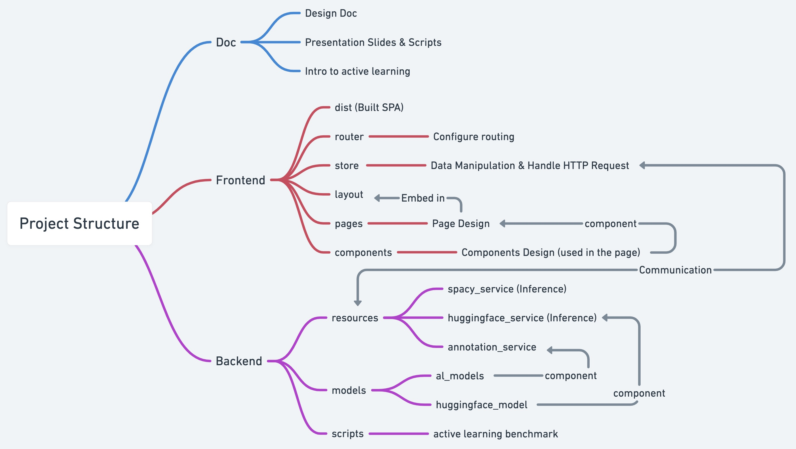

# DANER
Data Annotation Tool for Named Entity Recognition (DANER) using Active Learning and Transfer Learning. For a quick overview of the project, see [slides](./doc/slides_final.pdf). For more details, see [design_doc](./doc/design_doc.pdf).

Disclaimer: This project is a demo rather than a fully functional product. We may or not continue this project in the future.

# Reproducing

## Environment
  - Backend: Make sure you have all the packages as listed in `requirement.txt`, otherwise you may want to install them using the following command.
  
  ```bash
  # Run at the project root
  python -m venv env
  source env/bin/activate
  pip install -r requirement.txt
  ```
  - Frontend: Not necessary. But if you want to build the frontend yourself, you need to install the package using the following command.
  
  ```bash
  cd ./frontend
  npm install
  ```

## Run DANER
- Run DANER on local machine.
  - Run Backend: `python ./backend/app.py`
  - Run Frontend
    - Method 1: Run directly: Open `./frontend/dist/spa/index.html` in Browser.
    - Method 2: Build and Run: Build the frontend: `quasar build` and Method 1.
    - Method 3: Run in development mode: `quasar dev`.

- Run DANER on cluster
  - Run Backend on cluster:
    - `srun --mem=16G -c 4 --gres=gpu:1 -p interactive --qos=nopreemption --pty bash`
    - `python ./backend/app.py`
  - Setup Vector [VPN](https://support.vectorinstitute.ai/Vaughan_SSL_VPN_and_JupyterHub)
  - Run Frontend in the same way as above.

- Note
  - You may need to modify the baseURL in the GUI.

# Project Structure
We provide the following figure to better understanding of the project structure and modify the conresponding code to satisfy your personal needs.

